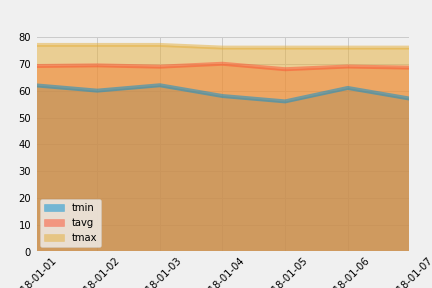

# Surfs_Up
Climate analysis and data exploration of your climate database has been done on Jupyter Notebook using Python and SQLAlchemy.

Also included an Flask API Application to query:
* Precipitations from last year
* Weather stations
* Temperature Observations (tobs) for the previous year
* Minimum temperature, the average temperature, and the max temperature for a given start and/or start-end range inlcusive.

                                     

                                       
 
